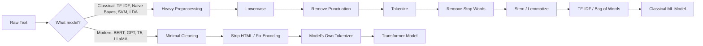
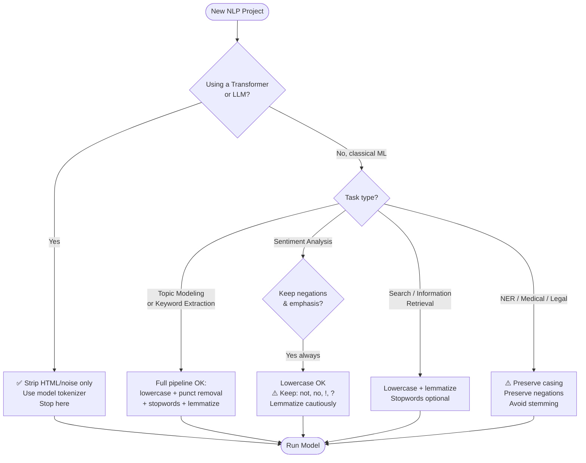
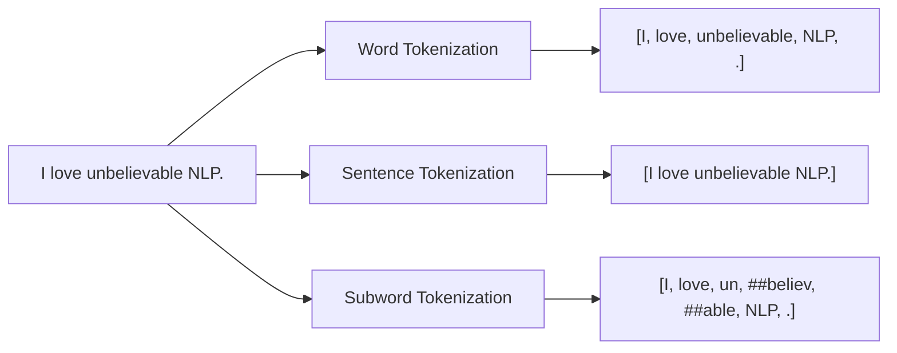

# 🧹 NLP Preprocessing — The Practical Guide

> A hands-on, opinionated guide to text preprocessing for NLP — covering **what** each step does, **when** it helps, and (more importantly) **when it quietly destroys your model**.

[](https://www.python.org/)
[](https://www.nltk.org/)
[](https://spacy.io/)
[](https://huggingface.co/transformers/)
[](LICENSE)

---

## Why this guide exists

Most tutorials present text preprocessing as a fixed checklist:

```
lowercase → remove punctuation → remove stop words → stem → done ✅
```

That checklist is **wrong for at least half of modern NLP projects.**

The right question is never *"what's the standard preprocessing pipeline?"* — it's:

> **What model am I using, what task am I solving, and what information must survive cleaning?**

This guide walks through the six classic preprocessing steps one by one, shows you exactly when each one helps and when it silently breaks things, and gives you runnable code for both classical and modern (Transformer-based) pipelines.

---

## 📚 Table of Contents

- [Quick Start](#-quick-start)
- [The Big Picture: Classical vs Modern NLP](#-the-big-picture-classical-vs-modern-nlp)
- [Decision Flowchart](#-decision-flowchart)
- [The Six Steps](#-the-six-steps)
  - [1. Lowercasing](#1-lowercasing)
  - [2. Tokenization](#2-tokenization)
  - [3. Removing Punctuation](#3-removing-punctuation)
  - [4. Removing Stop Words](#4-removing-stop-words)
  - [5. Stemming](#5-stemming)
  - [6. Lemmatization](#6-lemmatization)
- [Real-World Task Walkthroughs](#-real-world-task-walkthroughs)
- [The Master Decision Matrix](#-the-master-decision-matrix)
- [Pipeline Templates](#-pipeline-templates)
- [Common Pitfalls](#-common-pitfalls)
- [Cheat Sheet](#-cheat-sheet)
- [Project Structure](#-project-structure)
- [Further Reading](#-further-reading)

---

## 🚀 Quick Start

### Installation

```bash
# 1. Clone the repo
git clone https://github.com/<your-username>/nlp-preprocessing-guide.git
cd nlp-preprocessing-guide

# 2. Create a virtual environment
python -m venv .venv
source .venv/bin/activate          # Windows: .venv\Scripts\activate

# 3. Install dependencies
pip install -r requirements.txt

# 4. Download required NLTK data and spaCy model
python -m nltk.downloader stopwords punkt wordnet averaged_perceptron_tagger
python -m spacy download en_core_web_sm
```

### Run any example

```bash
python examples/01_lowercase.py
python examples/02_tokenization.py
python examples/03_punctuation.py
python examples/04_stopwords.py
python examples/05_stemming_lemmatization.py
python examples/06_classical_pipeline.py
python examples/07_transformer_pipeline.py
python examples/08_sentiment_comparison.py
```

Each file is **self-contained**, prints clearly labeled output, and can be run independently.

---

## 🗺️ The Big Picture: Classical vs Modern NLP

The single most important distinction in this guide:



**The rule of thumb:**

| Model Family | Preprocessing Philosophy |
|---|---|
| **Classical ML** (TF-IDF, Naive Bayes, Logistic Regression, SVM, LDA) | Aggressive cleaning helps — vocabularies shrink, signal-to-noise improves |
| **Transformers** (BERT, RoBERTa, DistilBERT, etc.) | Minimal cleaning — the tokenizer was *trained* on natural text |
| **LLMs** (GPT, Claude, LLaMA, Mistral) | Almost no cleaning — these models thrive on real-world messy text |

---

## 🧭 Decision Flowchart

Before you remove anything from your text, walk through this:



---

## 🔧 The Six Steps

### 1. Lowercasing

**What it does:** Converts all characters to lowercase. `"Apple"` → `"apple"`.

**Why it can help:** Without it, models see `Apple`, `apple`, and `APPLE` as three different tokens, bloating vocabulary and splitting signal.

**Visual example:**

```
Before: "The Movie was AMAZING! I love this MOVIE."
After:  "the movie was amazing! i love this movie."
```

Notice `Movie` and `MOVIE` collapsed into a single token `movie`.

**✅ Use it for:**

| Task | Why |
|---|---|
| TF-IDF / Bag of Words | Vocabulary shrinks, frequencies merge correctly |
| Topic modeling (LDA) | Cleaner topic-word distributions |
| Classical spam detection | `FREE` and `free` should be one feature |
| Naive search / keyword matching | Case-insensitive matching by default |

**❌ Avoid it for:**

| Task | Why |
|---|---|
| **Named Entity Recognition (NER)** | `Apple` (company) vs `apple` (fruit) — capitalization is the signal |
| Machine translation | Capitalization carries grammar and proper-noun info |
| LLM/GPT inputs | These models expect natural text |
| Acronym-heavy domains (medical, legal) | `US` (country) vs `us` (pronoun); `IT` (department) vs `it` (pronoun) |

**Code:** see [`examples/01_lowercase.py`](examples/01_lowercase.py)

---

### 2. Tokenization

**What it does:** Splits text into smaller units (tokens). Tokens can be words, subwords, sentences, or characters.

**Three flavors:**



**When to use what:**

| Type | Use Case | Tools |
|---|---|---|
| **Word** | Classical pipelines (TF-IDF, BoW) | `nltk.word_tokenize`, `str.split` |
| **Sentence** | Summarization, sentence-level classification | `nltk.sent_tokenize`, spaCy |
| **Subword** | Transformers (BERT, GPT, etc.) | `AutoTokenizer` from 🤗 Transformers |

**⚠️ Critical rule for Transformers:**

> **Never** pre-tokenize text manually before passing it to a Transformer. Always use the model's own tokenizer. Each model (BERT, GPT-2, RoBERTa, T5) was trained with a *specific* tokenizer — using a different one breaks the model.

```python
# ❌ WRONG
tokens = text.split()
model(tokens)  # broken

# ✅ RIGHT
from transformers import AutoTokenizer
tokenizer = AutoTokenizer.from_pretrained("bert-base-uncased")
inputs = tokenizer(text, return_tensors="pt")
model(**inputs)
```

**Code:** see [`examples/02_tokenization.py`](examples/02_tokenization.py)

---

### 3. Removing Punctuation

**What it does:** Strips `. , ! ? : ; " ' ( ) [ ]` and similar characters from text.

**Visual example:**

```
Before: "Wait... you really liked it?! That's wild!!!"
After:  "Wait you really liked it Thats wild"
```

**✅ Use it for:**

- Topic modeling (`!` rarely tells you the topic)
- Bag-of-words pipelines where you want a clean vocabulary
- Keyword extraction
- Search indexing

**❌ Avoid it for:**

| Task | What you lose |
|---|---|
| **Sentiment analysis** | `"Good."` vs `"Good!!!"` — exclamation marks encode intensity |
| **Question answering** | `?` is the literal signal that something is a question |
| **Chatbots / intent detection** | Punctuation often distinguishes intents |
| **Code-related NLP** | Punctuation *is* the syntax — `print("hi")` becomes garbage |
| **Translation** | Target-language punctuation depends on source |
| **LLMs** | They expect natural text |

**💡 Smarter approach:** instead of nuking all punctuation, remove only what's noisy and keep what carries meaning:

```python
import re
# Keep ! ? . but drop the rest
text = re.sub(r"[^\w\s!?.]", "", text)
```

**Code:** see [`examples/03_punctuation.py`](examples/03_punctuation.py)

---

### 4. Removing Stop Words

**What it does:** Removes very common, low-information words like `the`, `a`, `is`, `and`, `in`, `on`.

**Visual example:**

```
Before: "The government announced a new climate policy for renewable energy."
After:  "government announced new climate policy renewable energy"
```

The topic ("climate policy, renewable energy") is now much clearer for a bag-of-words model.

**✅ Use it for:**

- Topic modeling
- Keyword extraction
- TF-IDF features for document classification
- Search engine indexing
- Text clustering

**❌ The big trap — sentiment & negation:**

```
Original:    "This movie is not good."
After stop-word removal: "movie good"  ← MEANING FLIPPED 🚨
```

Standard English stop-word lists include words like `not`, `no`, `nor`, `never`, `without`, `against`, `between`. These are **critical** for:

| Task | Why |
|---|---|
| Sentiment analysis | "not good" and "good" are opposites |
| Medical NLP | "no fever" and "fever" have opposite clinical meaning |
| Legal NLP | "shall not" vs "shall" are legally opposite |
| Question answering | "Who is not eligible?" is a different question than "Who is eligible?" |

**💡 The fix:** always **customize** your stop-word list:

```python
from nltk.corpus import stopwords
stop_words = set(stopwords.words("english"))

# Negations & polarity-bearing words MUST stay
negations = {"not", "no", "nor", "never", "without", "against",
             "isn't", "aren't", "wasn't", "weren't", "don't", "doesn't",
             "didn't", "won't", "wouldn't", "can't", "cannot"}
stop_words -= negations
```

**Code:** see [`examples/04_stopwords.py`](examples/04_stopwords.py)

---

### 5. Stemming

**What it does:** Chops suffixes off words using simple rules to produce a rough "stem". Fast but crude — the output is often **not a real word**.

**Examples:**

| Word | Porter Stemmer Output |
|---|---|
| playing | play |
| played | play |
| studies | studi *(not a real word)* |
| studying | studi |
| connection | connect |
| connections | connect |
| connecting | connect |
| better | better *(doesn't know it relates to "good")* |

**✅ Use it for:**

- Search engines (cheap recall boost)
- Information retrieval over large corpora
- TF-IDF + classical classifier when speed matters
- Cases where producing real words doesn't matter — only collapsing variants does

**❌ Avoid it for:**

- Anything where output is shown to users
- Text generation
- Translation
- Modern Transformers (they handle word variants via embeddings)
- Domains where word forms matter (medical, legal)

**Code:** see [`examples/05_stemming_lemmatization.py`](examples/05_stemming_lemmatization.py)

---

### 6. Lemmatization

**What it does:** Reduces words to their dictionary base form (the **lemma**), using vocabulary and morphology rules. Output is always a real word.

**Stemming vs Lemmatization — side by side:**

| Word | Stemming (Porter) | Lemmatization (WordNet) |
|---|---|---|
| studies | studi | study |
| running | run | run |
| was | wa | be |
| were | were | be |
| better | better | good |
| caring | care | care |
| mice | mice | mouse |

**⚖️ Trade-off table:**

| Feature | Stemming | Lemmatization |
|---|---|---|
| Speed | ⚡ Fast | 🐢 Slower |
| Accuracy | Lower | Higher |
| Output a real word? | Usually no | Yes |
| Needs POS tags? | No | Often yes (for best results) |
| Best for | Search, IR | Classification, topic modeling |

**💡 POS-aware lemmatization:** WordNet's lemmatizer needs to know the part of speech to do its best work:

```python
from nltk.stem import WordNetLemmatizer
lemmatizer = WordNetLemmatizer()

lemmatizer.lemmatize("running")           # "running"   ❌
lemmatizer.lemmatize("running", pos="v")  # "run"       ✅
lemmatizer.lemmatize("better",  pos="a")  # "good"      ✅
```

**Code:** see [`examples/05_stemming_lemmatization.py`](examples/05_stemming_lemmatization.py)

---

## 🌍 Real-World Task Walkthroughs

### Example 1 — Classical Spam Detection

```
Input:  "FREE MONEY!!! Click here NOW to claim your prize!"
```

**Recommended pipeline:**

```
lowercase → light punct removal → tokenize → remove generic stop words
         → lemmatize → TF-IDF → Logistic Regression
```

```
Output: ["free", "money", "click", "claim", "prize"]
```

This works great for spam — but keep `not` (e.g., "not a scam") and consider keeping `!` as a feature (spammy texts have more of them).

---

### Example 2 — Sentiment Analysis (the danger zone)

```
Input:  "This movie is not good!!!"
```

**Naive (broken) pipeline:**

```python
text.lower()                # "this movie is not good!!!"
remove_punct(text)          # "this movie is not good"
remove_stopwords(text)      # "movie good"   ❌ Polarity inverted
```

**Correct pipeline:**

```python
text.lower()                # OK
# DO NOT remove punctuation aggressively (!!! is signal)
custom_stop_words = stop_words - {"not", "no", "never"}
# Lemmatize lightly
# Result: ["movie", "not", "good"]   ✅ Meaning preserved
```

Or simpler: **use a Transformer and skip almost all of this.**

```python
from transformers import pipeline
classifier = pipeline("sentiment-analysis")
classifier("This movie is not good!!!")
# [{'label': 'NEGATIVE', 'score': 0.999}]   ✅
```

---

### Example 3 — Topic Modeling

```
Input:  "The government announced a new climate policy for renewable energy."
```

**Recommended pipeline:**

```
lowercase → remove punct → remove stop words → lemmatize
```

```
Output: ["government", "announce", "new", "climate", "policy", "renewable", "energy"]
```

Topic models (LDA, NMF) love clean, lemmatized, content-word-only input. This is the textbook "full preprocessing" case.

---

### Example 4 — Named Entity Recognition

```
Input:  "Apple opened a new office in Toronto."
```

**Recommended pipeline:**

```
(almost nothing)  →  spaCy / Transformer NER model
```

- ❌ **Do not** lowercase — `Apple`/`apple` and `Toronto`/`toronto` are how the model recognizes entities
- ❌ **Do not** remove stop words — context like "in" tells the model what role the next word plays
- ❌ **Do not** stem/lemmatize — entity names should stay as written

---

### Example 5 — Medical NLP

```
Input:  "Patient has no chest pain and no shortness of breath."
```

**🚨 NEVER remove stop words here.** Removing `no` would yield:

```
"Patient has chest pain and shortness of breath."
```

— a clinically opposite (and potentially dangerous) statement.

**Recommended pipeline:**

```
preserve casing → preserve negations → use a domain-specific
tokenizer (e.g., scispaCy, BioBERT tokenizer) → domain model
```

---

## 📋 The Master Decision Matrix

| Task / Model | Lowercase | Remove Punct | Remove Stopwords | Stem/Lemma | Use Model Tokenizer? |
|---|:---:|:---:|:---:|:---:|:---:|
| **TF-IDF + Logistic Regression** | ✅ | ✅ | ✅ | ✅ (lemma) | — |
| **Naive Bayes spam filter** | ✅ | ⚠️ keep `!` | ✅ | ✅ | — |
| **LDA Topic Modeling** | ✅ | ✅ | ✅ | ✅ | — |
| **TF-IDF Sentiment (classical)** | ✅ | ⚠️ keep `!?` | ⚠️ keep negations | ⚠️ optional | — |
| **BERT classification** | depends on model | ❌ | ❌ | ❌ | ✅ Required |
| **GPT / LLM prompting** | ❌ | ❌ | ❌ | ❌ | handled by API |
| **Machine Translation** | ❌ | ❌ | ❌ | ❌ | ✅ Required |
| **Named Entity Recognition** | ❌ | ❌ | ❌ | ❌ | ✅ Required |
| **Question Answering** | ❌ | ❌ | ❌ | ❌ | ✅ Required |
| **Information Retrieval / Search** | ✅ | ✅ | optional | ✅ (lemma) | — |
| **Chatbot intent detection** | depends | ❌ | ❌ | ❌ | ✅ Required |
| **Medical / Legal NLP** | ❌ careful | ❌ careful | ❌ never | ❌ careful | use domain tokenizer |

Legend: ✅ recommended · ❌ avoid · ⚠️ do, but be careful

---

## 🧱 Pipeline Templates

### Template A — Full classical pipeline

```python
import re
import nltk
from nltk.corpus import stopwords
from nltk.tokenize import word_tokenize
from nltk.stem import WordNetLemmatizer

NEGATIONS = {"not", "no", "nor", "never", "without", "against"}
stop_words = set(stopwords.words("english")) - NEGATIONS
lemmatizer = WordNetLemmatizer()

def classical_preprocess(text: str) -> list[str]:
    text = text.lower()
    text = re.sub(r"http\S+|www\.\S+", " ", text)         # strip URLs
    text = re.sub(r"[^a-z\s!?]", " ", text)               # keep letters + ! ?
    tokens = word_tokenize(text)
    tokens = [t for t in tokens if t not in stop_words]
    tokens = [lemmatizer.lemmatize(t, pos="v") for t in tokens]
    return [t for t in tokens if len(t) > 1]
```

### Template B — Transformer pipeline (BERT, RoBERTa, etc.)

```python
from transformers import AutoTokenizer, AutoModelForSequenceClassification
import torch

tokenizer = AutoTokenizer.from_pretrained("distilbert-base-uncased-finetuned-sst-2-english")
model     = AutoModelForSequenceClassification.from_pretrained("distilbert-base-uncased-finetuned-sst-2-english")

def transformer_preprocess(text: str) -> dict:
    # Only strip obvious noise — let the tokenizer handle the rest
    text = text.strip()
    return tokenizer(text, padding=True, truncation=True, max_length=512, return_tensors="pt")

inputs = transformer_preprocess("This movie is not good!!!")
with torch.no_grad():
    logits = model(**inputs).logits
prediction = torch.argmax(logits, dim=-1).item()  # 0=NEG, 1=POS
```

### Template C — LLM / GPT pipeline

```python
# For an LLM, the only "preprocessing" you typically need is:
def llm_preprocess(text: str) -> str:
    text = text.strip()
    text = " ".join(text.split())        # normalize whitespace
    return text                          # that's it — send it to the model
```

---

## ⚠️ Common Pitfalls

> **Pitfall 1: "I'll apply the same pipeline to every NLP project."**
> Different tasks have different information needs. Always reason from the task downward.

> **Pitfall 2: "Stop word lists are universal."**
> They aren't. The default NLTK English list includes `not`, `no`, `against`, and `between`. For sentiment, QA, and medical NLP, you must customize it.

> **Pitfall 3: "Lowercase always helps."**
> Not for NER, not for translation, not for LLMs, not for anything where casing carries meaning.

> **Pitfall 4: "I'll just `.split()` the text before feeding it to BERT."**
> BERT (and friends) need their *own* tokenizer's subword IDs. Manual splitting breaks the model entirely.

> **Pitfall 5: "More cleaning = better model."**
> Often the opposite. With Transformers, less is more.

> **Pitfall 6: "I tested it once and it works."**
> Always compare preprocessing variants on a validation set. The right answer is empirical.

---

## 🃏 Cheat Sheet

```text
┌────────────────────────────────────────────────────────┐
│  CLASSICAL ML (TF-IDF, Naive Bayes, LR, SVM, LDA)      │
│  ─────────────────────────────────────────────────     │
│  Lowercase           : YES                             │
│  Remove punctuation  : YES (keep ! ? for sentiment)    │
│  Remove stop words   : YES (keep negations!)           │
│  Stemming / Lemma    : YES (prefer lemma if accurate)  │
│  Tokenizer           : NLTK / spaCy / sklearn          │
└────────────────────────────────────────────────────────┘

┌────────────────────────────────────────────────────────┐
│  TRANSFORMERS (BERT, RoBERTa, DistilBERT, T5)          │
│  ─────────────────────────────────────────────────     │
│  Lowercase           : depends on model (-uncased)     │
│  Remove punctuation  : NO                              │
│  Remove stop words   : NO                              │
│  Stemming / Lemma    : NO                              │
│  Tokenizer           : THE MODEL'S OWN TOKENIZER       │
└────────────────────────────────────────────────────────┘

┌────────────────────────────────────────────────────────┐
│  LLMs (GPT, Claude, LLaMA, Mistral)                    │
│  ─────────────────────────────────────────────────     │
│  Lowercase           : NO                              │
│  Remove punctuation  : NO                              │
│  Remove stop words   : NO                              │
│  Stemming / Lemma    : NO                              │
│  Tokenizer           : Handled by the API / library    │
└────────────────────────────────────────────────────────┘
```

---

## 📁 Project Structure

```
nlp-preprocessing-guide/
├── README.md                          ← you are here
├── requirements.txt
├── data/
│   └── sample_texts.txt               ← sample inputs for examples
└── examples/
    ├── 01_lowercase.py                ← lowercasing demo
    ├── 02_tokenization.py             ← word, sentence, subword
    ├── 03_punctuation.py              ← safe vs aggressive removal
    ├── 04_stopwords.py                ← custom stop-word lists
    ├── 05_stemming_lemmatization.py   ← side-by-side comparison
    ├── 06_classical_pipeline.py       ← full TF-IDF pipeline
    ├── 07_transformer_pipeline.py     ← BERT tokenizer demo
    └── 08_sentiment_comparison.py     ← naive vs smart preprocessing
```

---

## 📖 Further Reading

- **Speech and Language Processing** — Jurafsky & Martin (free online: https://web.stanford.edu/~jurafsky/slp3/)
- **NLTK Book** — https://www.nltk.org/book/
- **spaCy 101** — https://spacy.io/usage/spacy-101
- **Hugging Face Course** — https://huggingface.co/learn/nlp-course
- **The Illustrated Transformer** — http://jalammar.github.io/illustrated-transformer/

---

## 📝 The Golden Rule

> No preprocessing step is universally good or bad. The right pipeline is the one that
> **maximizes your validation-set metric for your specific task with your specific model.**
>
> When in doubt: try two pipelines, compare numbers, keep the winner.

Happy preprocessing. 🚀
